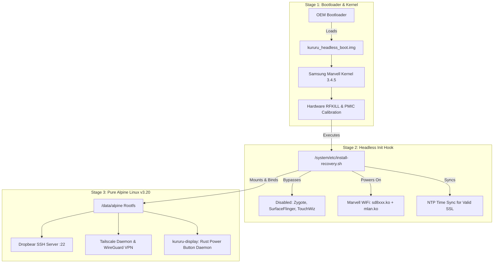

# 🐸 Kururu: Native Headless Linux Node for Samsung Galaxy Tab 3 Lite (SM-T110)

<div align="center">

[](https://github.com/ceduardorodrig/KURURU-TAB3LITE-LINUX/releases)
[](https://opensource.org/licenses/MIT)
[](https://www.rust-lang.org/)
[](https://alpinelinux.org/)
[](https://tailscale.com/)

*Turn an obsolete Samsung Galaxy Tab 3 Lite 7.0 into a bare-metal, headless Linux node with Tailscale WireGuard and Dropbear SSH.*

</div>

---

## 📖 Overview

Millions of **Samsung Galaxy Tab 3 Lite 7.0 (`SM-T110`, codename `goyawifi`)** devices are currently gathering dust in drawers worldwide. Officially stuck on Android 4.2.2 / 4.4.2, they cannot browse the modern web or run current applications.

**Kururu** transforms this device into a 24/7 dedicated, ultra-low-power (< 1W) **headless Linux server** running in your private **Tailnet** mesh network:
* **Zero Android Bloat:** Android Java runtime (`zygote`), GUI (`surfaceflinger`), and Google frameworks are disabled at bootloader/init level.
* **Massive RAM Gain:** RAM usage drops from ~750 MB down to **~43 MB**, leaving **>770 MB of free RAM** for Rust daemons and homelab services.
* **Integrated UPS / No-Break:** The tablet's built-in 3600 mAh battery acts as an uninterruptible power supply, keeping the node online for hours during power outages or line flickers.
* **100% Autonomous & Wireless:** Once bootstrapped, the device runs untethered from any PC. It only requires a standard micro-USB wall charger (5V / 1A) and communicates over Wi-Fi and WireGuard.
* **100% Hardware Stability:** Uses the official Samsung/Marvell Linux kernel 3.4.5 to keep proprietary Marvell SD8777 Wi-Fi calibration and AXP228 power management running flawlessly without overheating or dropping connection.
* **Pure Alpine Linux Userspace:** Modern Alpine v3.20 rootfs (`musl libc`) with native ARMv7 tools.
* **Physical Power Button & Live Dashboard:** Includes a custom background daemon (`kururu-display`) in Rust that renders real-time telemetry, a live kernel log console, and a dedicated status panel for core homelab nodes directly to the 1024x600 framebuffer.

---

## 🛠️ Hardware Specifications

| Component | Specification |
|---|---|
| **Device Model** | Samsung Galaxy Tab 3 Lite 7.0 (`SM-T110` / `samsung-goyawifi`) |
| **SoC** | Marvell PXA986 (Dual-Core ARM Cortex-A9 @ 1.2 GHz) |
| **Architecture** | `armv7l` (ARM 32-bit with NEON / VFPv3) |
| **System Memory** | 1 GB LPDDR2 (~816 MB available, **~770 MB free**) |
| **Internal Storage** | 8 GB eMMC v4.5 (5.1 GB dedicated `/data` ext4 partition) |
| **Wireless** | Marvell SD8777 (Single-Band 2.4 GHz 802.11 b/g/n, high wall penetration, 150 Mbps) |
| **Integrated Battery** | 3600 mAh Li-ion (acts as built-in hardware UPS / no-break) |
| **Power Consumption** | < 0.8W average in idle mode (screen unlit) |
| **Network Interfaces** | Native `mlan0` (Wi-Fi 2.4 GHz) + `tailscale0` (WireGuard mesh) |

---

## 🏗️ Architecture



---

## 🚀 Installation Guide

### Prerequisites
1. **Host machine (Linux):** With `adb`, `fastboot`, and `heimdall` installed.
2. **SM-T110 Tablet:** Connected via Micro-USB with USB Debugging enabled.
3. **Rust toolchain:** (If compiling crates locally) `rustup target add armv7-unknown-linux-musleabihf`.

### Step 1: Safety Backup
Before flashing anything, always take full raw dumps of critical radio and boot partitions:
```bash
./scripts/backup-partitions.sh
```

### Step 2: Flash TWRP Recovery
Reboot your tablet into Download Mode (`Power + Volume Down + Home`), then flash the TWRP 3.6.2 recovery image:
```bash
heimdall flash --RECOVERY pmos_twrp-3.6.2_9-0-goya.img --no-reboot
```

### Step 3: Deploy Alpine Linux Minirootfs
Boot into TWRP (`Power + Volume Up + Home`), mount `/data` and extract the Alpine minirootfs:
```bash
adb shell "mkdir -p /data/alpine"
adb push alpine-minirootfs-3.20.3-armv7.tar.gz /data/
adb shell "tar -xzf /data/alpine-minirootfs-3.20.3-armv7.tar.gz -C /data/alpine"
```

### Step 4: Configure Wi-Fi & SSH Keys
Copy and edit the Wi-Fi template:
```bash
cp rootfs/wpa_supplicant.conf.example /tmp/wpa_supplicant.conf
# Edit with your SSID and Passphrase
adb push /tmp/wpa_supplicant.conf /data/alpine/etc/wpa_supplicant/wpa_supplicant.conf

# Add your host public SSH key:
adb shell "mkdir -p /data/alpine/root/.ssh"
adb push ~/.ssh/id_ed25519.pub /data/alpine/root/.ssh/authorized_keys
adb shell "chmod 600 /data/alpine/root/.ssh/authorized_keys"
```

### Step 5: Flash Headless Boot Image
Build and flash the headless boot image:
```bash
cd boot && ./build-bootimg.sh && cd ..
adb push boot/kururu_headless_boot.img /tmp/boot.img
adb shell "dd if=/tmp/boot.img of=/dev/block/mmcblk0p10 bs=4096 && sync"
```

### Step 6: Reboot into Linux
Reboot into system mode:
```bash
adb shell "/sbin/busybox reboot"
```
The tablet will boot silently directly into Alpine Linux. In less than 30 seconds, it will associate with your Wi-Fi network and start Dropbear SSH and Tailscale.

---

## 🔑 Accessing Your Node

### Local LAN (SSH)
```bash
ssh root@192.168.3.55
```

### Worldwide (Tailscale Mesh)
Once authenticated into your Tailnet (`chimaera-heptatonic.ts.net`), connect from anywhere in the world:
```bash
ssh root@kururu
# or via Tailscale SSH CLI:
tailscale ssh root@kururu
```

---

## 📦 Included Rust Crates

### `crates/kururu-su`
A lightweight, zero-dependency `su` binary compiled statically for `armv7-unknown-linux-musleabihf` that bypasses Android Bionic's missing `/etc/passwd` limitation and supports chroot breakout tools.

### `crates/kururu-display`
An event-driven hardware and graphics daemon written in native Rust (`edition = "2021"`). Features:
* **Zero Overhead Framebuffer Rendering:** Directly maps `/dev/graphics/fb0` (1024x600, 32bpp) without running X11, Wayland, or Android SurfaceFlinger.
* **Multi-Tab Dashboard Navigation:** Listens to `/dev/input/event0` (`KEY_VOLUMEUP` and `KEY_VOLUMEDOWN`). Pressing the physical volume rocker smoothly cycles between 3 dedicated dashboards:
  1. **Tab 1 — Cluster Telemetry:** Live CPU load, RAM allocation, battery fuelgauge, tailnet mesh stats, and the 5 core homelab servers (`Psicopompo`, `Kuaray`, `Kavure`, `Ybytu`, `Ybyra`), plus dynamic `dmesg` kernel console.
  2. **Tab 2 — WoL Relay Status:** Hardware MAC addresses, Tailscale IPs, broadcast target `192.168.3.255:9`, and live HTTP trigger status for `psicopompo` and `kavure`.
  3. **Tab 3 — Retro Desk Clock:** Huge 4x scaled digital clock synchronized with NTP, local date, and full UPS battery meter and cell temperature.
* **Hardware Power & Sleep Control:** Listens to `/dev/input/event2` (Marvell 88PM822 PMIC `KEY_POWER`). Pushing the tablet's physical power button or volume rocker instantly wakes or sleeps the display panel, with an automatic 120-second inactivity sleep timer for maximum power efficiency (<0.8W).

### `crates/kururu-wake`
A native, sovereign Wake-on-LAN (WoL) burst relay and HTTP daemon written in Rust:
* **24/7 Resilient WoL Relay:** Because Kururu consumes < 1W and is equipped with a battery backup (UPS), it acts as the primary broadcast emitter on `192.168.3.255:9` directly attached to the main AP.
* **CLI & HTTP Endpoints:**
  - CLI: `kururu-wake psicopompo`, `kururu-wake kavure`, or custom MAC.
  - HTTP Daemon (port `9096`):
    - `GET /wake/<target_host>` → Emits burst of 5 magic packets to the configured target MAC (e.g. `d0:94:66:XX:XX:XX`).
    - `GET /health` → Real-time status probe.

---

## 📄 License

This project is licensed under the [MIT License](LICENSE).

---

<div align="center">

> **Yes... This is a Vibe Coded project**
>
> Governed by 🤖 **StenioSentinel** (our Rust-based AI Governance Sentinel) with **Carlos Eduardo Rodrigues** ([@ceduardorodrig](https://github.com/ceduardorodrig)).

</div>
